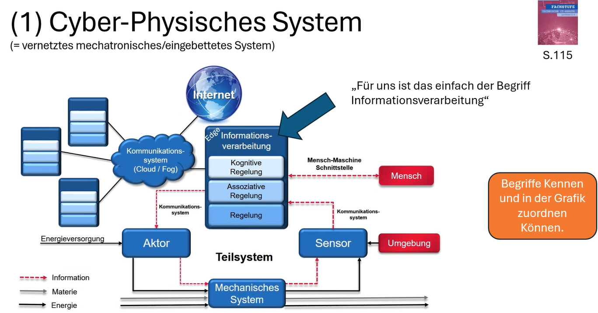

# CPS‑Zuordnung: „Cyber‑Physisches System“‑Grafik auf dieses Projekt abbilden

## Elemente der Grafik ↔ Elemente unseres Anzucht‑Systems

### Umgebung
Die Umgebung (außen und im Gehäuse) beeinflusst das Pflanzenwachstum:
- Lichtintensität (Tag/Nacht, Fenster/Innenraumlicht)
- Luftfeuchte/Temperatur
- Bodenfeuchte
- Pflanzenhöhe (Abstand zur Oberkante)

### Sensor
Sensoren wandeln physikalische Größen in Daten (Information) um:
- Lichtsensor (LDR/Modul) → `LDR=...`
- Bodenfeuchte → `SOIL=...`
- DHT22 (Luftfeuchte/Temperatur) → `Hum=... TempC=...`
- IR‑Distanz (Abstand Pflanze → Deckel) → `DistCm=...`

Diese Werte werden im Sketch über `readSensors()` erfasst.

### Informationsverarbeitung (Edge)
Der Arduino ist die „Informationsverarbeitung“: Daten lesen → entscheiden → Aktoren schalten → Anzeige/Audio aktualisieren.

Die 3 Ebenen aus der Grafik lassen sich so zuordnen:
- **Regelung** (klassische Regel-/Schaltlogik):
  - Licht unter Schwellwert → Zusatzlicht EIN; über Schwellwert → AUS (Hysterese)
  - Boden trocken → Pumpe für feste Zeit EIN; Mindestintervall gegen häufiges Schalten
- **Assoziative Regelung** (Kombination mehrerer Bedingungen):
  - „dunkel (LDR) ODER Nachtzeitfenster“ → Ambient‑LED EIN
- **Kognitive Regelung** (höhere Strategie/„Wissen“):
  - Wachstumstage aus Startdatum berechnen
  - Begrüßung pro Tag nur einmal zu definierten Uhrzeiten abspielen

Relevante Funktionen: `updateControl()`, `checkAndGreet()`, `growthDayNumber()`, `updateDisplay()`.

### Aktor
Aktoren setzen Entscheidungen in physikalische Wirkung um:
- Zusatzlicht (Grow‑LED) → verändert Licht
- Ambient‑LED → Beleuchtung/Atmosphäre bei Dunkelheit
- Pumpe/Sprüher → verändert Bodenfeuchte (Stoff-/Wasserfluss)
- Grüne LED bei Abstand < 5 cm → Statussignal für den Menschen
- Lautsprecher (Durchsage) → akustischer Hinweis

### Mensch‑Maschine‑Schnittstelle
So interagiert der Mensch mit dem System:
- LCD zeigt Datum und Wachstumstage (Zustand sichtbar)
- Reset‑Taste setzt das Startdatum (Wachstumstage) zurück
- Serielle Ausgabe dient Debug & Kalibrierung

### Kommunikationssystem (Cloud/Fog) & Internet
Der aktuelle Stand ist ein lokales Edge‑System: Die Regelung läuft vollständig auf dem Arduino, ohne Internet.

Für eine „vollvernetzte“ CPS‑Variante wären mögliche Erweiterungen:
- ESP8266/ESP32 (WLAN) zum Upload von Sensordaten (Feuchte/Licht/Bewässerungslog)
- Web-/App‑Dashboard (Remote‑Monitoring, Schwellwerte ändern)
- Cloud‑Speicher und Benachrichtigungen (z. B. Warnung „zu trocken“)

### Energieversorgung
Die „Energie“‑Flüsse aus der Grafik entsprechen hier:
- 5V Versorgung für Arduino + Sensorik + DFPlayer/LCD
- separate Lastversorgung (z. B. 12V) für LED‑Streifen/Pumpe
- gemeinsame Masse (GND) und Entstörung/Isolation (Relais/Motoren sind Störquellen)

### Mechanisches System
Das mechanische/physische System umfasst:
- Gehäuse, Halterungen, ggf. Reflektoren/Abdeckungen
- Wassertank/Schläuche/Düsen/Pumpe
- Pflanzen, Erde, Schale/Tray

## Legende: Information / Materie / Energie im Projekt
- **Information** (rote gestrichelte Linie): Sensordaten, Schaltentscheidungen, Displaytext, Audio‑Trigger
- **Materie** (grau): Wasserfluss Tank → Pumpe → Schlauch/Düse → Erde
- **Energie** (schwarz): elektrische Versorgung Arduino/LED/Pumpe
